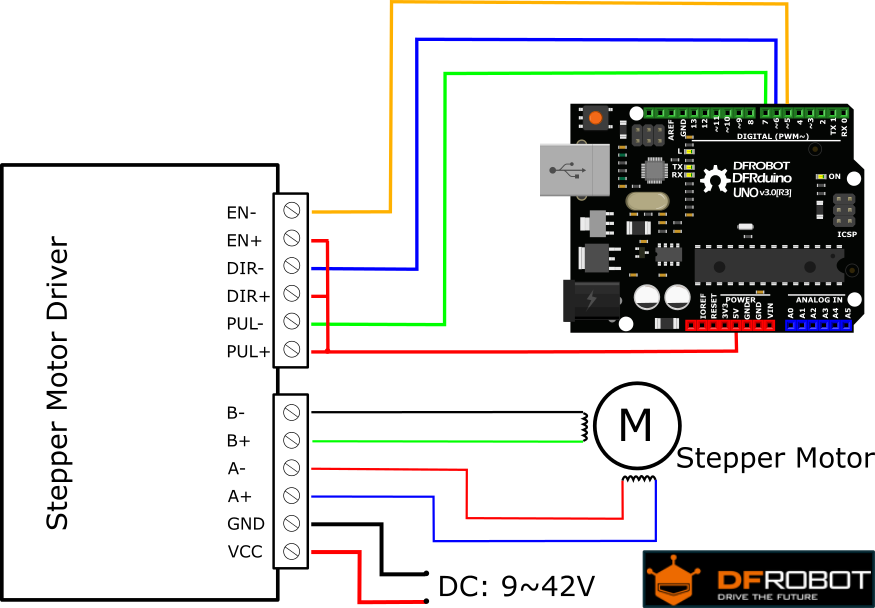
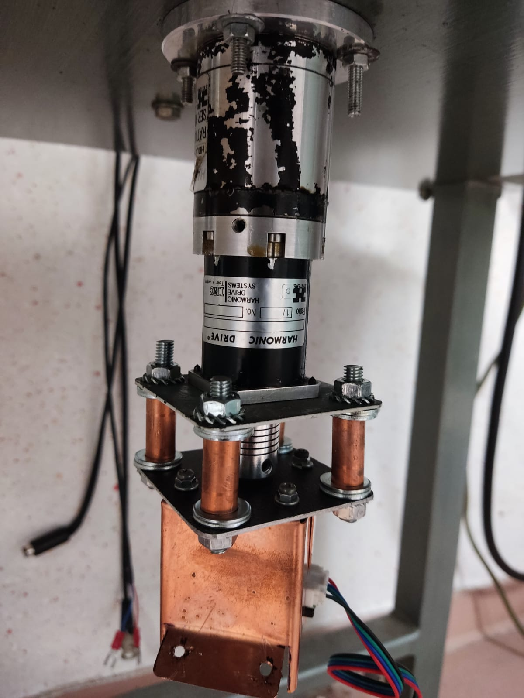
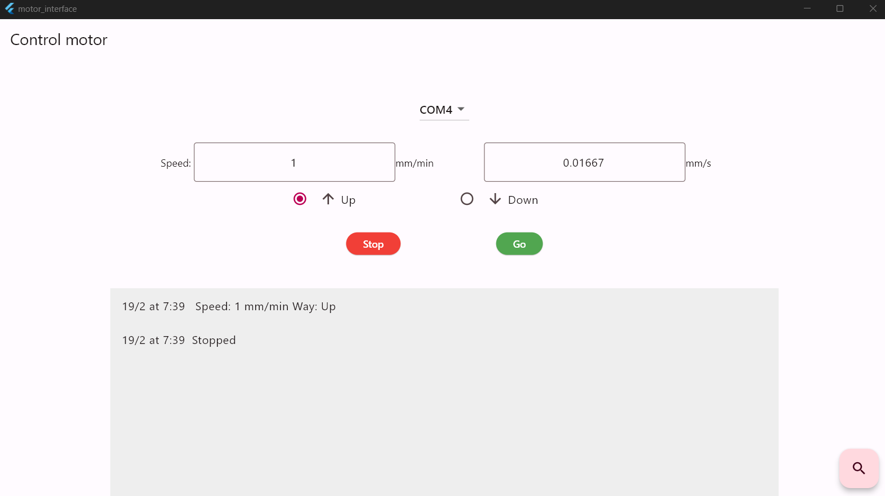
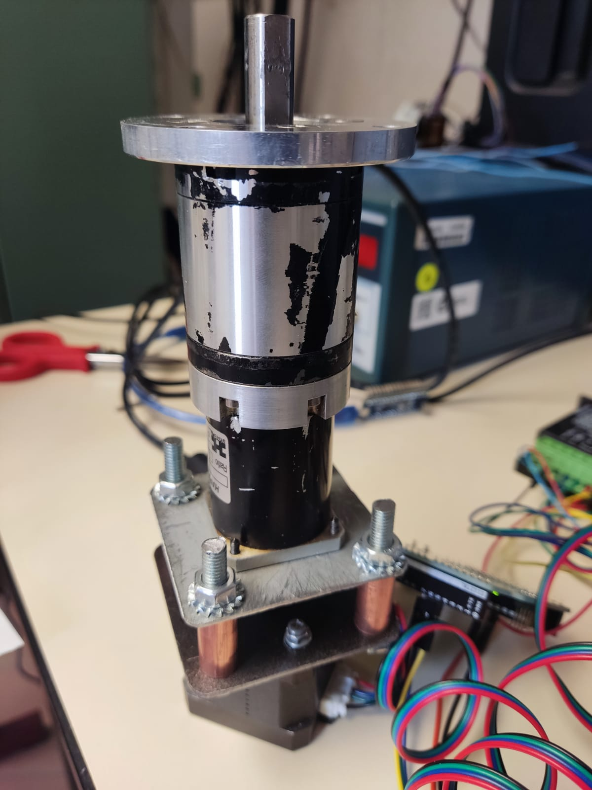

## Stepper Motor Control with TB6600 and Arduino

The TB6600 is a stepper motor driver, capable of supporting motors with currents up to 4.0A and operating at voltages from 9V to 42V DC. Its compatibility with Arduino allows for precise control of stepper motors for CNC applications, with the ability to adjust direction, speed, and steps through programming. To make control even more accessible, the implementation includes a graphical user interface through Flutter.

### Connection Schematic with Arduino
For the correct connection and operation of the system, follow the schematic below:

### Motor Assembly and Configuration
The stepper motor used in this project is coupled to a 100:1 gearbox and a precision linear rail with a 5mm lead, providing enhanced precision and torque:

Communication and Control

Communication with the Arduino is carried out via serial, using the following command format:
Enable;Direction;Speed(mm/s);

For example, to turn on the motor, moving it upwards at a speed of 0.15 mm/s, the command would be:
1;1;0.15;

### Flutter Graphical Interface
The graphical interface, developed in Flutter, makes motor control accessible and intuitive. To get started, install the application using the mysetup.exe file available in the installer folder.

Select the COM port to which the Arduino is connected.
Choose the direction of movement.
Send the move or stop command as needed.

